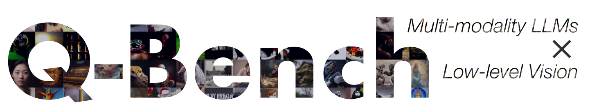
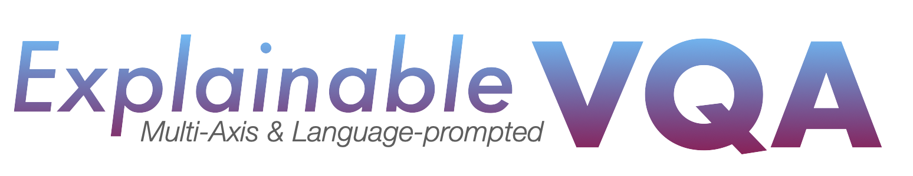
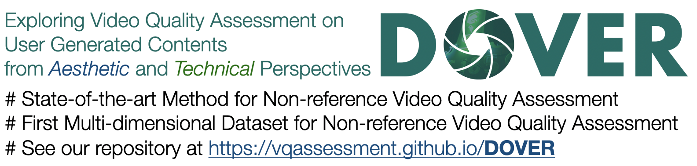

# Visual Quality Assessment

Maintained by: [Teo Wu](https://teowu.github.io) (Haoning Wu)

🌟New: We have published a benchmark for **multi-modality large language models (MLLMs)** on low-level vision and visual quality assessment!

See our 🖥️[codebase](https://github.com/VQAssessment/Q-Bench) and 📑[paper](https://https://www.researchgate.net/publication/374156853_Q-BENCH_A_BENCHMARK_FOR_GENERAL-PURPOSE_FOUNDATION_MODELS_ON_LOW-LEVEL_VISION)!

We are a young research team from [Nanyang Technological University (NTU)](ntu.edu.sg) and [Sensetime Research](sensetime.com), aiming to build efficient and explainable Image and Video Quality Assessment approaches as well as exploring the perceptual mechanisms behind the human quality perception.

### Selected Research Projects

Code repositories to our works under the project:

#### ExplainableVQA

[MaxVQA and MaxWell database](https://github.com/VQAssessment/MaxVQA) (ACM MM, 2023) | [Paper](https://arxiv.org/abs/2305.12726) 

- An Extended 16-dimensional Video Quality Assessment Database
- Query Multi-Axis Dimension Specific Quality via Language (CLIP)
- Try our demo at [Github](https://vqassessment.github.io/ExplainableVQA)

#### DOVER (Aesthetic VQA)

[DOVER](https://github.com/VQAssessment/DOVER) (ICCV, 2023) | [Paper](https://arxiv.org/abs/2211.04894) | 

- State-of-the-art Method for Non-reference Video Quality Assessment
- First Multi-dimensional Dataset for Non-reference Video Quality Assessment
- See our repository at [Github](https://vqassessment.github.io/DOVER)

#### FAST-VQA *(end-to-end!)*

[FAST-VQA/FasterVQA](https://github.com/VQAssessment/FAST-VQA-and-FasterVQA) | [ECCV-2022](https://arxiv.org/abs/2207.02595) | [TPAMI, 2023](https://arxiv.org/abs/2210.05357) 

- The first end-to-end Video Quality Asssessment method family!
- Super Efficient, real-time even on Apple M1 CPU!
- See our weights/code/toolbox at [Github](https://vqassessment.github.io/FAST-VQA-and-FasterVQA)

